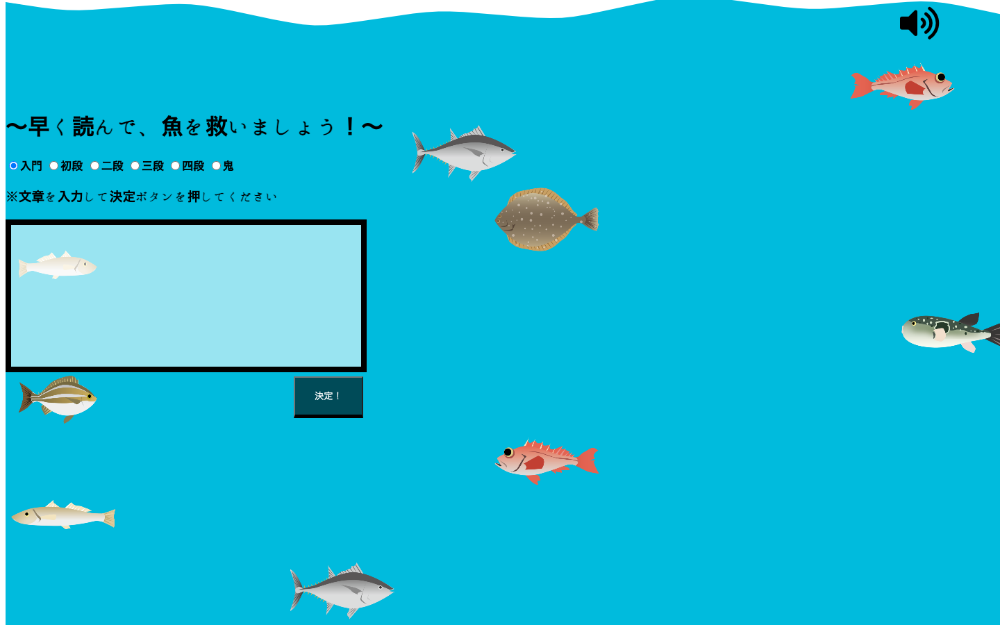

# 「速読み水族館」
  

## 1. 目的
このアプリの目的は文章をダラダラ読むことを防止することです。私は自分にとって興味のない文章を読む際、ダラダラ読んでしまうことがよくあります。そのため、このようなことが続くと文章を早く読む力が衰えてしまうのではないかという危機感を感じました。これを解決するには読んでいる最中に自分がダラダラ読んでいることを感じることのできるアプリを作るのがいいのではないかと考え、このアプリを作成しました。

##	2. アピールポイント
- 入門、初級、二段、三段、四段、鬼の中からレベルを選ぶことができる。
-	好きな文章でプレイすることができる。
- 	自動スクロール時はユーザーがスクロールを制御することはできない仕様となっている。
- 	スクロール停止時は背景にある水が徐々に排水され、泳いでいるエリアに水がなくなった魚は死ぬ仕組みとなっている。
-	背景にある水の排水速度は読む文章が長いほど遅くなる。
-	魚が死ぬ際は効果音が鳴る。
-	スクロール停止ボタンを押した後にスクロール開始ボタンを押すとスクロール停止ボタンを押す直前の位置からスクロールが再開される。その際、排水は止まる。

##  3.使用した技術等
- 言語
   - HTML,JavaScript,css
- ライブラリ
   - TweenMax

